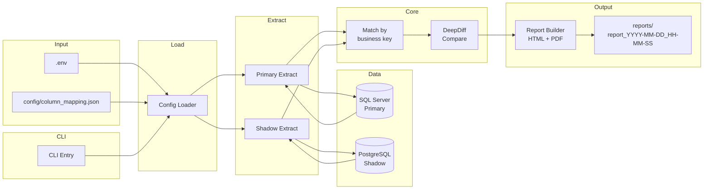
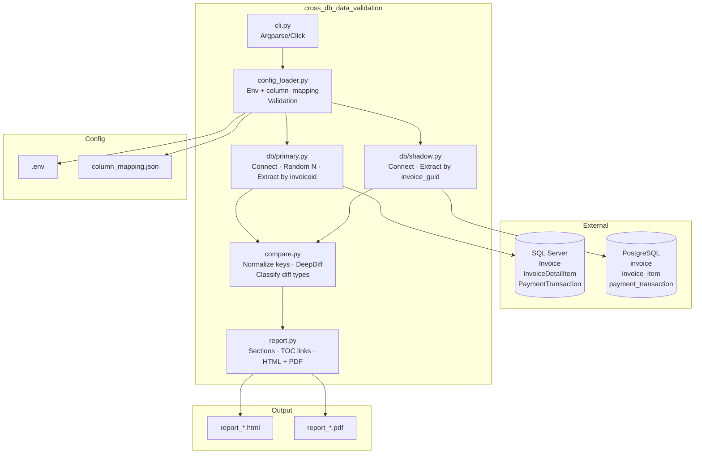
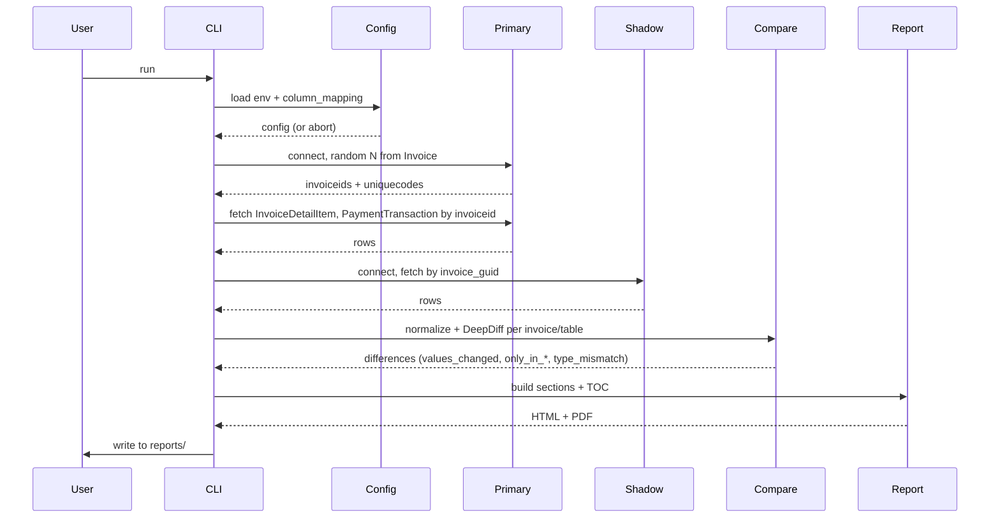

# Technical Architecture – Cross-DB Data Validation

## High-level flow

---

## Component view

---

## Data flow (per run)

---

## Legend

| Symbol / term | Meaning |
|----------------|--------|
| **Primary** | SQL Server: Invoice, InvoiceDetailItem, PaymentTransaction (link: invoiceid). |
| **Shadow** | PostgreSQL: invoice, invoice_item, payment_transaction (link: invoice_guid). |
| **Config Loader** | Reads .env and column_mapping.json; validates; exposes to extract/compare. |
| **Match** | For table 2 & 3, pair rows by business key from column mapping. |
| **DeepDiff** | Compare normalized row dicts; map result to values_changed, only_in_primary, only_in_shadow, type_mismatch. |
| **Report** | One HTML + one PDF per run; section per invoice; TOC links; filename includes execution datetime. Header shows compared sources (Primary vs Shadow), environment (from config), and run datetime with timezone. |

---

*See PLAN.md for full planning decisions and quality standards.*
